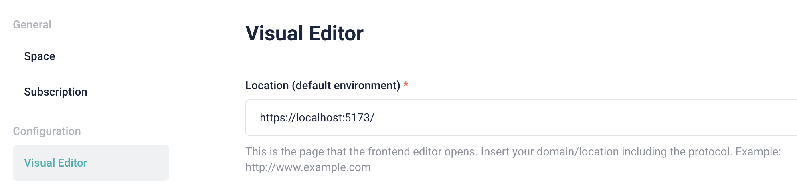
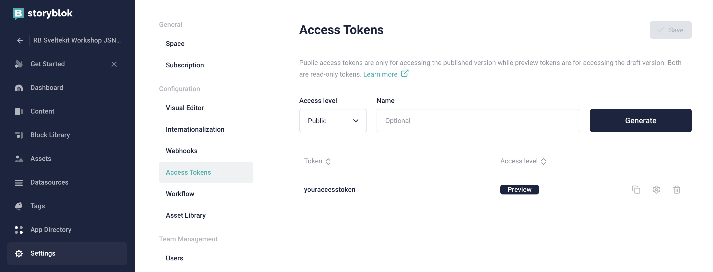

# Sveltekit Storyblok Workshop

This is the repository for tracking all the processes for creating a sample SvelteKit application with Stroyblok.
The GitHub repository is here: [sveltekit-storyblok-workshop](https://github.com/roberto-butti/sveltekit-storyblok-workshop)

## Install SvelteKit

```shell
# Installing SveteKit base project
npm create svelte@latest sveltekit-storyblok-workshop
# Installing package in the project directory
cd sveltekit-storyblok-workshop
npm install
# Adding local Git
git init && git add -A && git commit -m "Initial commit"
# Running the local web server and open the browser
npm run dev -- --open
```

## Creating Storyblok space

To obtain your access token, you have to [create a new Storyblok space](https://app.storyblok.com/#/me/spaces/new).
You can create a space for free by selecting the "Community plan".

## Configuring the Visual Editor

In the "Settings" section, selecting the "Visual Editor" tab, you can set the `Location (default environment)` with `https://localhost:5173/`



## Getting the Access Token

In the "Settings" section, selecting the "Access Tokens" tab, you can get your access token.



## Setting the Access token

For setting the access token you can copy the `.env.example` file into `.env` file or in general you have to set the following 2 parameters in the `.env` file:

```
PUBLIC_ACCESS_TOKEN=yourspaceaccesstoken
PUBLIC_REGION=eu
```

These two parameters will be used in the Storyblok connection.

## Enabling HTTPS

To enable the HTTPS protocol, the easiest way is to install the _basicSsl_ plugin:

```sh
npm i --save-dev @vitejs/plugin-basic-ssl
```

In the `vite.config.js` file, you have to use the _basicSsl_ plugin:

```js
import { sveltekit } from '@sveltejs/kit/vite';
import { defineConfig } from 'vite';
//001 import the basicSsl
import basicSsl from '@vitejs/plugin-basic-ssl';

export default defineConfig({
	//002 add basicSsl() in the `plugins` list
	plugins: [sveltekit(), basicSsl()]
});
```

Now, when you run `npm run dev`, the SvelteKit application is served via the default `5173` port and the HTTPS protocol instead of the usual HTTP protocol.

So you can access your application at https://localhost:5173/

> For security reasons, the first time you will access the page via HTTPS protocol, the browser will ask you to accept the self-signed certificate automatically generated by the _basicSsl_ plugin during the bootstrap.

## Installing the Stroyblok Svelte SDK

```
npm install @storyblok/svelte
```

Make sure that the `typescript` and the `svelte-preprocess` packages are installed (in devDependencies).

## Configuring the svelte.config.js file

In the `svelte.config.js` file, make sure you are setting the `preprocess` :

```js
const config = {
	kit: {
		adapter: adapter()
	},
	// 002 setting the preprocess
	preprocess: [vitePreprocess()]
};
```

Make sure that the vitePreprocess is imported:

```js
// 001 import the vitePreprocess
import { vitePreprocess } from '@sveltejs/kit/vite';
```

## Installing TailwindCSS

```shell
npm install -D tailwindcss postcss autoprefixer
npx tailwindcss init -p
```

In the `svelte.config.js` make sure that you are loading the `vitePreprocess()` as `preprocess`.

> Vite Preprocess is included in the _sveltejs/vite-plugin-svelte_. You don't have to include it in your `package.json` file, just because the Vite Plugin Svelte is a dependency of _sveltejs/kit_. Or, instead of using the Vite Preprocess you can install the [svelte preprocess](https://github.com/sveltejs/svelte-preprocess). Svelte Preprocess provides extra functionalities not available with Vite preprocessors, such as template tags, external files, and global styles.

In the `tailwind.config.js` make sure that you are setting `./src/**/*.{html,js,svelte,ts}` as `content` .

Add `app.css` file in `src/` directory and set TailwindCSS directive:

```css
@tailwind base;
@tailwind components;
@tailwind utilities;
```

## Installing DaisyUI

```shell
 npm i -D daisyui
```

For loading DaisyUI, in the `tailwind.config.js` require the DaisyUI plugin in the `plugins` section:

```js
plugins: [require('daisyui')];
```

## Installing Storyblok Svelte SDK

```sh
npm install @storyblok/svelte
```

## Setup the storyblok instance

Create a JS file to collect all the common functions you can use in your project. For example, I suggest creating the `useStoryblok` function where you can call the `storyblokInit` function from the Storyblok Svelte SDK that allows you to instance the Storyblok objects.

For example you can create `sblib.js` in the `lib/` directory:

```js
import { apiPlugin, storyblokInit } from '@storyblok/svelte';
// 001 Import the environment variables
import { PUBLIC_ACCESS_TOKEN } from '$env/static/public';
import { PUBLIC_REGION } from '$env/static/public';

export async function useStoryblok(accessToken = '') {
	// 002 setting the access token (from environment variable)
	accessToken = accessToken === '' ? PUBLIC_ACCESS_TOKEN : accessToken;
	// 003 call storyblok init
	await storyblokInit({
		// 004 using the access token
		accessToken: accessToken,
		// 005 using the apiPlugin (for connecting with Stroyblok API)
		use: [apiPlugin],
		// 006 listing the needed components
		components: {
			feature: (await import('$lib/components/Feature.svelte')).default,
			grid: (await import('$lib/components/Grid.svelte')).default,
			page: (await import('$lib/components/Page.svelte')).default,
			teaser: (await import('$lib/components/Teaser.svelte')).default
		},
		// 007 setting some api options like https, cache and region
		apiOptions: {
			https: true,
			cache: {
				type: 'memory'
			},
			region: PUBLIC_REGION // "us" if your space is in US region
		}
	});
}
```

## Connecting with Storyblok API

For connecting to the Storyblok API, you can call the useStoryblok function in the SvelteKit `load()` function in the `+page.js` file.

Then you can obtain the response result (the Storyblok Story) and send it to the `+page.svelte` file via the `return`.

```js
import { useStoryblokApi } from '@storyblok/svelte';
import { useStoryblok } from '$lib/sblib';

/** @type {import('./$types').PageLoad} */
export async function load() {
	await useStoryblok();

	let storyblokApi = await useStoryblokApi();

	const dataStory = await storyblokApi.get('cdn/stories/home', {
		version: 'draft'
	});

	return {
		story: dataStory.data.story
	};
}
```

## Using the dynamic Storyblok component

The goal is to load the proper components on the page (in the `+page.svelte` file).

Because in the `load()` function of `+page.js` file, we are returning an object with the `story` property, you can access that object it in the `+page.svelte`, exporting a `data` variable. With the `data` object, you can access `data.story`.

In the `script` section, you can export the object (we are going to name it `data,` but you can change the name):

```js
export let data;
```

Then in the templating section, you can access that data object (to `data.story`):

```svelte
<StoryblokComponent blok={data.story.content} />
```

> See `src/routes/+page.svelte` for more info.

## Creating the components

Because the StoryblokComponent loads the Stroyblok Component, you must create the svelte components for each component used in the page.

For example, in the `home` story, we are using:

- The Page component (as content type)
- the Teaser component (as a nested component)
- the Grid component (as a nested component)
- The Feature component (as a nested component of the Grid component).

The loaded components are listed in the storyblokInit function (in our useStoryblok common function).

The Svelte components are created [in the `src/lib/components` directory](<(src/lib/components)>).

A minimal Svelte component should be:

```svelte
<script>
	import { storyblokEditable } from '@storyblok/svelte';
	export let blok;
</script>

<div use:storyblokEditable={blok}>
	{blok.headline}
</div>
```

In this example, your component has one field named "headline".

## Activating the Storyblok Bridge

The editable action allows you to interact with Storyblok Bridge (for creating a real-time preview experience in the Storyblok Visual Editor).

To activate the editable field, you have to use the action use:storyblokEditable, and you have to set up the Bridge in the onMount function of your `+page.svelte` file.

```js
onMount(() => {
	if (data.story) {
		useStoryblokBridge(data.story.id, (newStory) => (data.story = newStory));
	}
});
```

for importing the `useStroyblokBridge` :

```js
import { useStoryblokBridge, StoryblokComponent } from '@storyblok/svelte';
```

## Creating a new pages

For allowing the creation of pages that reply to /[slug], for example like `/about` , `/page` , `/myproject` etc., you can create a `[slug]` folder in the `src/routes` directory. In the `[slug]` directory, you can create the `+page.js` file, similar to the previous one, but in this case, instead of retrieving the Storyblok story with the hardcoded value `home`, you can use the parameter `slug`.

So, create src/routes/[slug] folder. In the folder create the +page.js file:

```js
import { useStoryblokApi } from '@storyblok/svelte';
import { useStoryblok } from '$lib/sblib';

/** @type {import('./$types').PageLoad} */
export async function load({ params }) {
	const slug = params.slug;

	await useStoryblok();

	let storyblokApi = await useStoryblokApi();

	const dataStory = await storyblokApi.get('cdn/stories/' + slug, {
		version: 'draft'
	});

	return {
		story: dataStory.data.story
	};
}
```

Then create `+page.svelte` file:

```js
<script>
	import { onMount } from 'svelte';
	import { useStoryblokBridge, StoryblokComponent } from '@storyblok/svelte';
	import '../../app.css';
	import Header from '$lib/components/Header.svelte';
	export let data;

	onMount(() => {
		if (data.story) {
			useStoryblokBridge(data.story.id, (newStory) => (data.story = newStory));
		}
	});
</script>

<div>
	<Header />
	<StoryblokComponent blok={data.story.content} />
</div>

```

In Storyblok create the story `/about`.

## Build static website (SSG)

INstall the adapter for static pages:

```sh
npm i -D @sveltejs/adapter-static@latest
```
